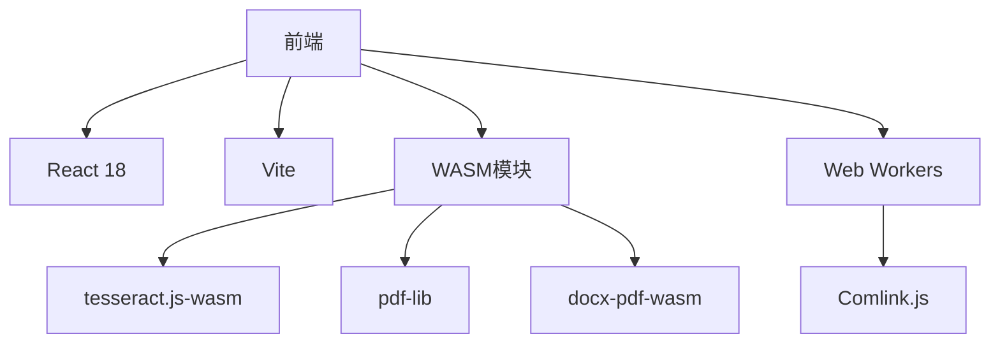

以下是 **DocuSynapse** 的 **1周MVP版本开发计划**，聚焦核心价值功能，确保可演示、有技术亮点且可快速实现：

### MVP核心原则

- **技术亮点优先**：突出 WASM/安全/AI 能力
- **闭环场景**：完成「上传→处理→下载」完整流程
- **开发可行性**：7天内可交付演示版

### MVP功能清单（按优先级排序）

#### 1. **核心转换引擎**（必做）

|功能|实现方案|耗时|交付物|
|---|---|---|---|
|PDF → DOCX 转换|pdf-lib.js + WASM文本提取|1天|可编辑DOCX文件|
|DOCX → PDF 转换|docx-pdf (基于Puppeteer Core WASM)|1天|带基础水印的PDF|
|扫描件OCR (JPG→可搜PDF)|Tesseract.js WASM版 + 自动纠偏|1.5天|可复制文本的PDF|

#### 2. **安全增强模块**（关键技术亮点）

|功能|实现方案|耗时|交付物|
|---|---|---|---|
|基础文字水印|pdf-lib文本图层叠加|0.5天|"Confidential"字样水印|
|身份证号检测熔断|正则匹配(/\d{17}[\dX]/) + 弹窗警告|0.5天|风险文档拦截功能|

#### 3. **效能基础**（保证可用性）

| 功能               | 实现方案           | 耗时   | 交付物      |
| ---------------- | -------------- | ---- | -------- |
| Web Workers多线程处理 | Comlink封装耗时操作  | 1天   | 界面不卡顿    |
| 进度可视化            | 环形进度条 + 文件大小估算 | 0.5天 | 用户感知等待时间 |

#### 4. **极简交互界面**（可演示）

| 功能      | 实现方案           | 耗时   | 交付物        |
| ------- | -------------- | ---- | ---------- |
| 文件拖拽上传区 | react-dropzone | 0.5天 | 拖拽上传5天     |
| 格式选择下拉框 | MUI Select组件   | 0.2天 | PDF/DOCX切换 |
| 水印文字输入  | 受控输入框          | 0.3天 | 自定义水印文本    |
| 下载按钮    | 带状态禁用逻辑        | 0.2天 | 结果文件下载     |

### 技术栈精简方案

### 每日开发计划

|日期|核心任务|里程碑|
|---|---|---|
|**Day1**|PDF→DOCX转换引擎|完成5页测试PDF转换|
|**Day2**|DOCX→PDF+水印基础|生成带水印的PDF文档|
|**Day3**|扫描件OCR集成|图片转可搜索PDF|
|**Day4**|Web Workers多线程架构|处理百页PDF时不冻结界面|
|**Day5**|安全模块(身份证检测+水安全模块(身份证检测+水印)|触发熔断时阻止下载|
|**Day6**|前端界面开发|完成完整交互流程|
|**Day7**|联调测试+性能优化|MVP演示版部署|

### MVP版本限制说明

Diff

`- 不支持的功能：   1. 生物特征水印（简化为基础文字水印）   2为基础文字水印）   2. 多文件批量处理（单文件优先）   3. 复杂格式转换（如LaTeX/EPUB）   4. 高级压缩算法（后续迭代）    + 保留的核心价值：   1. 浏览器端全本地处理（无服务器！）   2. OCR+水印+安全熔断技术闭环   3. WASM+Web Workers性能展示`

### 演示场景设计

1. **合规场景** 上传包含身份证的合同.docx → 添加水印 → 触发熔断警告 → 人工审核后下载
    
2. **扫描件场景** 上传发票照片.jpg → 转换为可搜索PDF → 复制发票编号
    
3. **简历亮点**
    
    > “7天实现DocuSynapse MVP：
    > 
    > - 本地化完成**PDF/DOCX/扫描件**互转
    > - 集成**WASM OCR引擎**（Tesseract.js）
    > - 实现**安全熔断机制**拦截敏感文档
    > - Web Workers保障**百页文档处理不卡顿**”
    

### 扩展准备

预留以下接口便于后续迭代：

JavaScript

`// 水印系统扩展点 registerAdvancedWatermark(watermarkImpl: IWatermark) {  // 预留DNA水印接口 }  // 格式转换插件机制 addConverter(from: string, to: string, handler: Converter) {  // 后续添加EPUB/LaTeX等 }`

此方案确保在7天内交付具有确保在7天内交付具有技术深度的可演示MVP，完美展示浏览器端文档处理的核心竞争力。